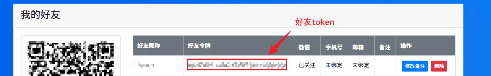

# tech-study-node

### 描述 Description

- 基于 `Node.js` 的自动化学习强国工具

- 依赖 `puppeteer` / `puppeteer-core` 实现浏览器控制

- 依赖 `node-schedule` 实现定时任务

- 依赖 `vitest` 完成基础功能的单元测试

- 通过学习强国`PC 网页版`完成学习任务

- 如果感觉配置麻烦，去看看 [油猴插件脚本版](https://github.com/Xu22Web/tech-study-js '油猴插件脚本版') `https://github.com/Xu22Web/tech-study-js`

### 优点 Advantages

- 学习强国 `PC 网页版` 学习任务的完美解决方案

- 基于 `puppeteer` / `puppeteer-core` 的 API 操作浏览器，实现登录二维码捕获、DOM 元素操作以及处理滑动验证的功能

- 基于 `PushPlus` 推送功能，通过微信远程接收学习情况和服务运行情况

- 基于 `node-schedule` 设置定时任务，每天自动运行定时任务

### 安装与运行 Install and Run

1. 安装依赖

```
pnpm install
```

2. （ `Windows` 跳过）在 `Linux` 上安装 Puppeteer 依赖（[官方 GitHub 说明](https://github.com/puppeteer/puppeteer/blob/main/docs/troubleshooting.md#chrome-headless-doesnt-launch-on-unix 'Linux 的 Puppeteer 依赖')）

> 确保安装了所有必要的依赖项。你可以在 Linux 上运行 `ldd chrome | grep not` 来检查缺少哪些依赖项。下面提供常见必要的依赖项：

<details>
<summary>Debian (e.g. Ubuntu) Dependencies</summary>

```
 apt install \
 gconf-service \
 libasound2 \
 libatk1.0-0 \
 libc6 \
 libcairo2 \
 libcups2 \
 libdbus-1-3 \
 libexpat1 \
 libfontconfig1 \
 libgcc1 \
 libgconf-2-4 \
 libgdk-pixbuf2.0-0 \
 libglib2.0-0 \
 libgtk-3-0 \
 libnspr4 \
 libpango-1.0-0 \
 libpangocairo-1.0-0 \
 libstdc++6 \
 libx11-6 \
 libx11-xcb1 \
 libxcb1 \
 libxcomposite1 \
 libxcursor1 \
 libxdamage1 \
 libxext6 \
 libxfixes3 \
 libxi6 \
 libxrandr2 \
 libxrender1 \
 libxss1 \
 libxtst6 \
 ca-certificates \
 fonts-liberation \
 libappindicator1 \
 libnss3 \
 lsb-release \
 xdg-utils \
 wget
```

</details>

<details>
<summary>CentOS Dependencies</summary>
   
  ```bash
   yum install -y \
   alsa-lib.x86_64 \
   atk.x86_64 \
   cups-libs.x86_64 \
   gtk3.x86_64 \
   ipa-gothic-fonts \
   libXcomposite.x86_64 \
   libXcursor.x86_64 \
   libXdamage.x86_64 \
   libXext.x86_64 \
   libXi.x86_64 \
   libXrandr.x86_64 \
   libXScrnSaver.x86_64 \
   libXtst.x86_64 \
   pango.x86_64 \
   xorg-x11-fonts-100dpi \
   xorg-x11-fonts-75dpi \
   xorg-x11-fonts-cyrillic \
   xorg-x11-fonts-misc \
   xorg-x11-fonts-Type1 \
   xorg-x11-utils
  ```

</details>

3. 安装 `Google Chrome` 浏览器（注意：`Chromium` 无法使用，`视听学习` 的网页会打开错误），并配置 `executablePath`

<details>
<summary>CentOS</summary>

- 配置 yum 源

  - 在目录 `/etc/yum.repos.d/` 下新建文件 `google-chrome.repo`

    ```bash
     cd /etc/yum.repos.d/
     vim /ect/yum.repos.d/google-chrome.repo
    ```

  - 编辑文件 `google-chrome.repo` ，保存并退出

    ```
     [google-chrome]
     name=google-chrome
     baseurl=http://dl.google.com/linux/rpm/stable/$basearch
     enabled=1
     gpgcheck=1
     gpgkey=https://dl-ssl.google.com/linux/linux_signing_key.pub
    ```

- 安装 `Google Chrome` 浏览器

  - Google 官方源安装：

    ```bash
     yum -y install google-chrome-stable
    ```

  - Google 官方源可能在中国无法使用，需添加参数:

    ```bash
     yum -y install google-chrome-stable --nogpgcheck
    ```

- 测试运行 `Google Chrome` 浏览器

```bash
 google-chrome
 # 或
 google-chrome-stable
```

- 在 Puppeteer 配置中，将 `executablePath` 字段值改为 `google-chrome` 或 `google-chrome-stable`

</details>

<details>
<summary>Windows</summary>

- 下载安装 `Google Chrome` 浏览器

  - 官网安装：[Google Chrome 网络浏览器](https://www.google.cn/intl/zh-CN/chrome 'Google Chrome 网络浏览器')

- 准备可执行文件 `Google Chrome` 浏览器

  - 在项目根目录，新建文件夹 `.local_chromium`

    ```
     md .local_chromium
    ```

  - `Google Chrome` 安装根目录 `C:/Program Files/Google/Chrome/Application` （不一定是这个路径，根据自身情况而定），安装根目录里的 `chrome.exe` 等文件（不含文件夹）、 文件夹 `1xx.0.xxx.xxx` 里的 `1xx.0.xxx.xxx.manifest` 等文件（不含文件夹）以及 `1xx.0.xxx.xxx`里的`Locales` 文件夹（即标记 `✔` 的文件及文件夹），复制到 `.local_chromium`

    ```
     Application
      │  chrome.exe                          ✔
      │  chrome.VisualElementsManifest.xml   ✔
      │  chrome_proxy.exe                    ✔
      │  master_preferences                  ✔
      │
      └─1xx.0.xxx.xxx
         │  1xx.0.xxx.xxx.manifest           ✔
         │  1xx.0.xxx.xxx.manifest           ✔
         │  chrome.dll                       ✔
         │  ... ...                          ✔
         │
         └─Locales                           ✔
    ```

- 在 Puppeteer 配置中，将 `executablePath` 字段值改为 `.local_chromium/chrome.exe`

</details>

4. 完善基础配置

   1. 查看更改 `Puppeteer 配置`（`src/config/pup.ts`），需要注意的配置项

      - `headless` 无头模式，即是否非图形界面显示

      - `executablePath` 可执行文件路径，由于项目采用 `Google Chrome` + `puppeteer-core` 的形式，需要手动下载浏览器并配置此项

   2. 查看更改 `Schedule 配置`（`src/config/schedule.ts`），单或多个定时任务配置

      ```js
      [
        {
          // 若 `Push 配置`中 `enabled` 为 true，任务配置的用户 `token` 为必填项
          /**
           * @description 用户昵称
           */
          nick: '用户昵称',
          /**
           * @description 自己或者好友 token  (-)
           */
          token: '用户 token',
          /**
           * @description cron 表达式
           * @example '0 0 12 * * ?' 表示12点, ['0 0 12 * * ?', '0 0 13 * * ?'] 表示十二点和十三点
           */
          cron: '0 0 12 * * ?',
          /**
           * @description 学习项目配置
           * @example  [文章选读, 视听学习, 每日答题]
           */
          taskConfig: [true, true, true],
          /**
           * @description 专项练习 答题失败（由于答完结算，仅包含答题异常或无答案）退出不提交
           * @example true 退出答题不提交 false 继续答题
           */
          paperExitAfterWrong: false,
        },
      ];
      ```

      ```
        # 关于`node-schedule`定时任务的`cron`表达式

        *    *    *    *    *    *
        ┬    ┬    ┬    ┬    ┬    ┬
        │    │    │    │    │    │
        │    │    │    │    │    └ 星期 (0 - 7) (0 或 7 是星期天)
        │    │    │    │    └───── 月 (1 - 12)
        │    │    │    └────────── 日 (1 - 31)
        │    │    └─────────────── 时 (0 - 23)
        │    └──────────────────── 分 (0 - 59)
        └───────────────────────── 秒 (0 - 59，可选)
      ```

   3. 查看更改 `Study 配置`（`src/config/study.ts`），需要注意的配置项

      - `qrcodeLocalEnabled` 登录二维码本地保存，便于在无头模式登录（开启推送后，自行关闭）

   4. 启用 `PushPlus` 推送步骤（不需要推送请跳过）

      - 在 [PushPlus 官网](https://www.pushplus.plus/ 'PushPlus 官网') 上，注册登录账号。若有其他用户，可添加其他用户为好友。（[PushPlus 好友消息](https://www.pushplus.plus/liaison.html 'PushPlus 好友消息')，官方默认采用 `微信公众号` 推送）

      - 更改 `Push 配置`（`src/config/push.ts`），设置`enabled`为`true`，添加管理员`token`（`管理员`能接收到服务推送以及错误推送，`用户`只能接受到自己的学习通知）

        ```js
          {
            /**
             * @description 启用推送
             * @example true 启用推送 false 禁用推送
             */
            enabled: true,
            /**
             * @description 发送服务消息昵称
             */
            nick: '管理员',
            /**
             * @description 发送服务消息来源
             */
            from: 'tech-study-node',
            /**
             * @description 管理员的 token
             */
            token: '管理员 token',
          }

        ```

        

      - 更改 `Schedule 配置`（`src/config/schedule.ts`），添加用户`token`

        ```js
        [
          {
            /**
             * @description 管理员或者好友 token
             */
            token: '用户 token',
          },
        ];
        ```

        

        

5. 运行

```
pnpm start
```

6. 定时任务开启时，`学习强国 APP` 扫码登录

   - 未开启 `PushPlus` 推送

     > 注意：`Puppeteer 配置`（`src/config/pup.ts`）中的 headless 字段（new 非图形界面，false 图形界面）

     - 对于图形界面，可直接扫码登陆

     - 对于非图形界面，扫描 src/qrcode 目录下的二维码

   - 开启 `PushPlus` 推送，保存微信公众发送消息里的二维码，扫码登录

### 配置 Configuration

- Puppeteer 配置 `src/config/pup.ts` （[官方文档配置](https://pptr.dev/api/puppeteer.launchoptions 'Puppeteer 使用和配置')）

- Study 配置 `src/config/study.ts` （学习配置）

- PushPlus 配置 `src/config/push.ts` （推送配置）

- API 配置 `src/config/api.ts` （接口配置）

- URL 配置 `src/config/url.ts` （链接配置）

- Schedule 配置 `src/config/schedule.ts` （定时任务配置）

### 附加 Addition

- 在 `test` 文件夹下，依赖 `vitest` 完成基础功能的单元测试

  - `login` 用户登录

  - `watch` 文章选读，视听学习

  - `exam` 每日答题，专项练习

  - `error` 错误测试

  - `api` 测试 API 可用性

  - `log` 测试日志生成保存和自动删除

  - `extension` 浏览器插件测试
